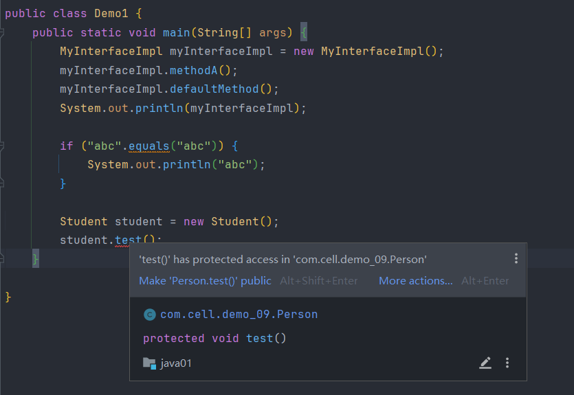

| 修饰符         | 当前类 | 同一个包 | 子类  | 其他包       |
| ----------- | --- | ---- | --- | --------- |
| `public`    | ✅   | ✅    | ✅   | ✅         |
| `protected` | ✅   | ✅    | ✅   | ❌（非子类不可见） |
| 默认（不写）      | ✅   | ✅    | ❌   | ❌         |
| `private`   | ✅   | ❌    | ❌   | ❌         |

# 一.public

>被`public`修饰的类或者成员对所有的类都是可见的,它的访问范围是最大的,适合作为提供外部访问的接口,工具类或者常量

**(1) 一个.java文件只允许使用public修饰一个顶层类**

>一个 `.java` 文件中可以定义多个类，但最多只能有一个顶层类使用 `public` 修饰。这个 `public` 类被视为“主类”，通常作为文件的对外接口存在，其他类则作为辅助逻辑存在，只能在当前包中使用。
>
>如果一个类被声明为 `public`，那么它所在的源文件名必须与该类的类名完全一致（包括大小写）,这是为了确保类名与文件名的一一对应关系，方便编译器定位源文件并生成正确的 `.class` 文件

****

**(2) public修饰的类必须类名=文件名**

>使用这种命名贵伐可以让程序的可读性变得很高,当知道类名时就可以很快的知道它的源文件是`类名.java`,如果类名与文件名不一致时,编译器就无法知道最终的`.calss`文件应该命名成什么,以及路径该怎么设置,这也是为什么idea创建类时会自动把文件名和类名设置成一样的原因

>但是其他的修饰符修饰的类可以类名!=文件名,因为`public`的特性,它修饰的类可以被所有地方的类使用,为了方便其他地方的类能够顺利的,Java就强制把它弄成这样,非`public`修饰的类无法被其他包中的类访问,所以不存在寻找麻烦的问题,但是还是建议和文件名一致比较合适

****

# 二.protected

>`protected`主要用于控制类的成员（字段、方法和构造器）的访问范围,可以被当前包中的类/其他包中的子类访问

****

**(1) protected不能用来修饰顶层类**

>因为顶层类是用来被其他类访问的,所以只能被设置成`public`或者默认

****

**(2) protected用于类的继承结构中**

>protected允许子类访问父类成员,这样可以避免外部的非子类来访问,例如某个类中定义了一个方法,我只想给我的子类使用,就可以设置成`protected`,非子类就无法通过 `对象.方法名` 调用

****

**(3) protected和包**

>`protected`不依赖包,在同一个包中它的作用就和默认的一样,允许所有类方法,但只有子类可以跨包使用

****

**(4) 子类可以访问 `protected` 方法，但不能通过父类引用或外部对象访问**

>子类能访问`!=`任何地方都能通过子类方法,而是需要调用这个子类的那个类和使用`protected`的类在同一个包中,或者在子类的内部代码中使用,不能在别的包的类中通过创建子类对象来调用`protected`方法,就算当前类是子类,也不行

****

# 三.默认修饰符

>当没有明确使用修饰符时,类\方法\字段的访问权限默认是包级别的,意思就是同一个包中的类就可以访问,其他包中的就不能方法

****

**(1) 默认修饰的类无法作为主类**

>因为是被默认修饰符修饰的类,说明它无法被其他包中的类访问,它只能在当前包中被访问

****
# 四.private

>`private`修饰符是权限最高的修饰符,通常用来隐藏成员变量,是封装的必要修饰符,他的存在让Java的安全性更高

****

**(1) 修饰字段**

>被`private`修饰的字段只能被当前类访问使用,这样可以避免外部随意对它们进行修改,提高程序的安全性,因为无法被随意修改所以添加了set\get方法,它们是被`public`修饰的,因为这样才能确保某些字段可以提供给外部使用

****

**(2) 修饰方法**

>`private`方法只能被当前类使用,通常是作为补充逻辑存在的,它不提供给外部,防止外部误用或者重写导致程序结构崩溃

****

**(3) 修饰构造器**

>使用`private`后类中的构造器就不能被外部使用,也就是说外部不能随意的new对象了,可以用这个特性控制对象的创建规则,例如单例模式和传统工具类

****

**(4) 抽象方法不能使用private**

>因为抽象方法都是要用来重写的,如果使用`private`修饰的话就不能被继承了,何谈重写

