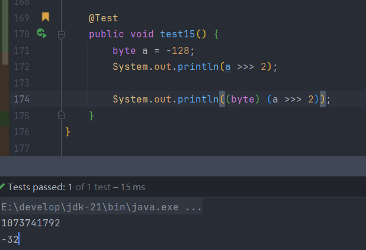

# 一.逻辑运算符

>逻辑运算符要求两边的操作数都是布尔类型,并且最终运算结果也是布尔类型

```
& 逻辑与(并且)
| 逻辑或(或者)
^ 逻辑异或(相同false不同true),对整数的每个二进制位进行异或运算
int a = 10; //1010
int b = 5;  //0101
a^b = 1111 = 15

! 逻辑非

短路现象,前面有一个false,短路与就不会执行后面的内容
前面有一个true,短路或就不会执行后面的内容
&& 短路与
|| 短路或
```

# 二.按位运算符

>按位运算符的操作数必须是整数,否则会出现编译错误,因为float和double采用 IEEE 754 浮点数表示法，包括符号位、指数位和尾数位，而不是直接存储的二进制整数

>移位操作本质是二进制位运算,所以八进制和十六进制的移位都会先转换成二进制在进行移位运算

```
<< 左移
>> 右移
>>> 无符号右移
& 按位与
| 按位或
^ 按位异或
~ 按位取反
```

## 1.左移

>将二进制数左移n位等于将数值乘以2<sup>n</sup>,左移后右边补上0,且不改变操作数的符号,但是会对溢出进行截断,需要注意的是,因为计算机底层是对补码进行操作的,所以这里的左移是对补码进行左移

**正数左移:**  

```
int a = 10;
原码:    00000000 00000000 00000000 00001010
反码:    00000000 00000000 00000000 00001010
补码:    00000000 00000000 00000000 00001010
左移2位: 00000000 00000000 00000000 00101000(补码) -> 40
```

**负数左移:**

```
int a = -100;
原码:    10000000 00000000 00000000 01100100
反码:    11111111 11111111 11111111 10011011
补码:    11111111 11111111 11111111 10011100
左移2位: 11111111 11111111 11111110 01110000(补码)
原码:    10000000 00000000 00000001 10010000 -> -400
```

## 2.右移

>右移n位等于除以2<sup>n</sup>,右移时符号位不变,正数左边补0,负数左边补1,会对溢出进行截断,对于0,右移仍然是0

**正数右移:**

```
int a = 1;
原码:    00000000 00000000 00000000 00000001
反码:    00000000 00000000 00000000 00000001
补码:    00000000 00000000 00000000 00000001
右移1位: 00000000 00000000 00000000 00000000 1(舍弃) -> 0
```

**负数右移:**

```
int a = -128;
原码:    10000000 00000000 00000000 10000000
反码:    11111111 11111111 11111111 01111111
补码:    11111111 11111111 11111111 10000000
右移三位: 11111111 11111111 11111111 11110000(补码)
原码:    10000000 00000000 00000000 00010000 -> -16
```

**无符号右移:**

>右移时不考虑符号位,并将最高位补充为0,任意一个数字经过无符号右移后一定是非负数

```
byte a = -128;
原码:    10000000
反码:    11111111
补码:    10000000
右移2位: 00100000(补码) -> 32
以上的理论是对的,但是在实际编译中是错误的,因为定义的a为byte类型,但是a >>> 2 中的2是int类型,所以这里面存在一次类型转换,把a转换成int类型了,所以实际的输出并不是32,而是
00111111 11111111 11111111 11100000(补码) -> 1073741792
那如果在移位操作的前面加上(byte)进行强转呢 sout((byte)(a >>> 2)),结果依然不是32,因为在强转的过程中,是先把a转换成int类型,也就是移位后a的补码不是00100000,而是11100000(补码)
->10100000(原码) -> -32,也就是砍掉了前面的三个字节的储存内容,并不是直接变成上面写的那样,一开始就按照byte的类型来进行移位
```



## 3.按位与 &

>将两个整数的二进制表示按位进行运算,同1为1,有0则0

```
int a = 10;                   ... 1010
int b = 5;                    ... 0101
sout(a & b);//0               ... 0000
```

>因为二进制的特殊性,只要是奇数,这个数的最低位一定是1,所以可以用这个特性来判断某个数是否为奇数

```
if ((a & 1) == 1)  sout("奇数")
```

## 4.按位或 |

>有1则1,全0才0

```
int a = 10;                ... 1010
int b = 5;                 ... 0101
sout(a | b);//15           ... 1111
```

>根据按位或的特性,可以用它来设置标志位

>将0(0000 0000)低位的第四位设置为1

```
int a = 0;
a = a | (1 << 3);0000 0001 -> 0000 0100

```


