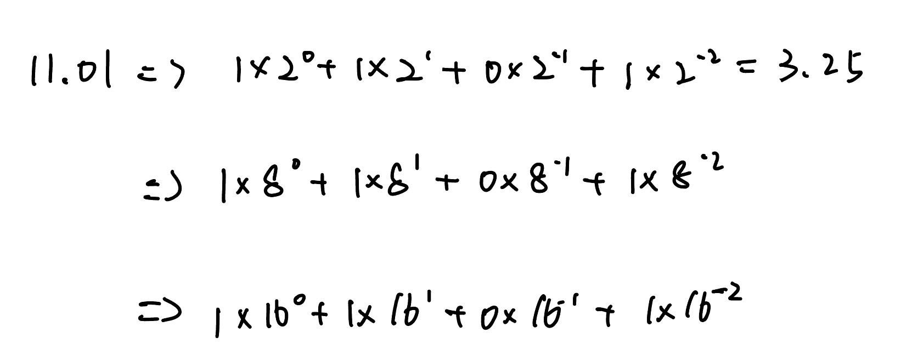
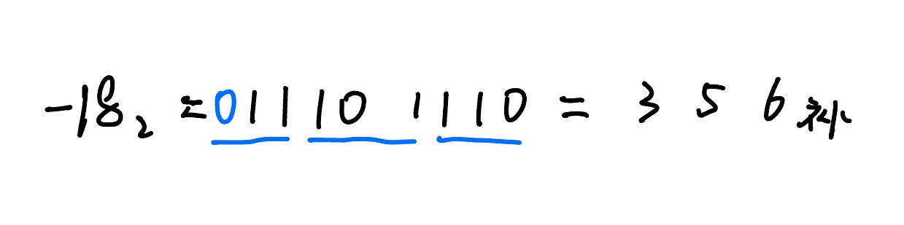
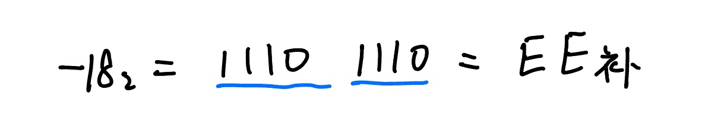
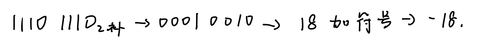
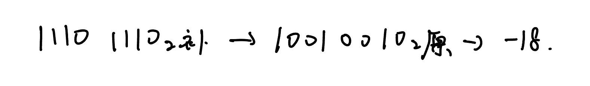
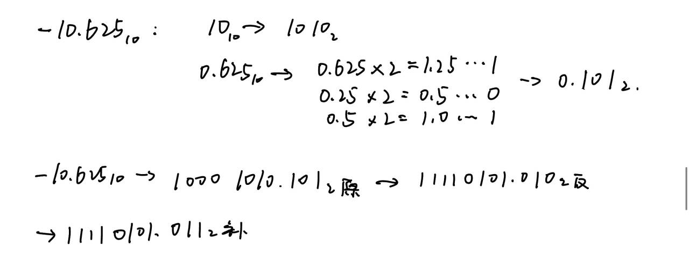
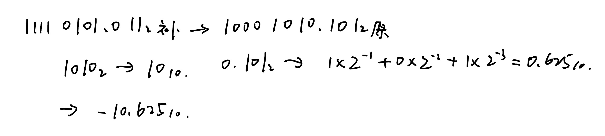
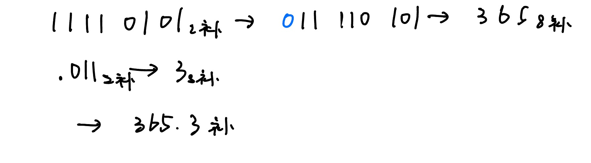

# 一.R转十与十转R

## 1.整数

### 1.二转十

>每位展开相加

### 2.十转二

>十进制数除以2，余数为权位上的数，得到商继续除以2，直到商为0终止，然后反向取余数

### 3.八进制

### 4.十六进制

## 2.小数

### 1.十转二

>乘2取整,顺序输出,直到为整1,否则看取几位

### 2.二,八,十六转十

>展开相加

# 二.二八十六互转

## 1.二转八,十六

>转八就划三位,转十六就划四位

## 2.八转二

>八进制数通过除2取余法，得到二进制数，对每个八进制为3个二进制

## 3.十六转二

### 4.八,十六互转

>先转十然后再互转

# 三.负数

## 1.整数

### 1.十进制转二进制

>以8位为例,先取整数的绝对值转换成二进制,然后符号位取1

>[-18]原=1001 0010

>但是负数在进制之间的转换通常采用补码的方式,所以-18的二进制为:[-18]补=1110 1110

### 2.二->八

>负数的转换与正数的类似,只是用补码的形式表示,如果要换到原码就要再转换成二进制

### 3.二->十六

### 4.二->十

>在补码的基础上,全部取反再加1,最后再添加上符号(只适用于负数)

>或者也可以转换成原码后再转成十进制

## 2.小数

### 1.十->二

>最后的加1是在小数部分加1

### 2.二->十

>把补码转换成原码后再转换成十进制

### 3.二->八

### 4.二->十六

