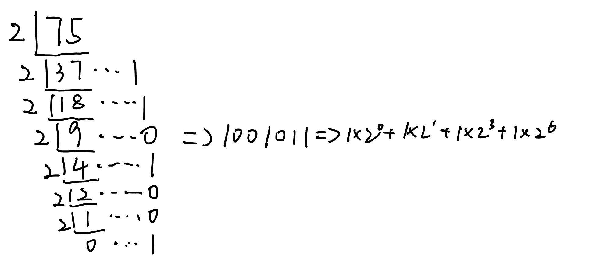
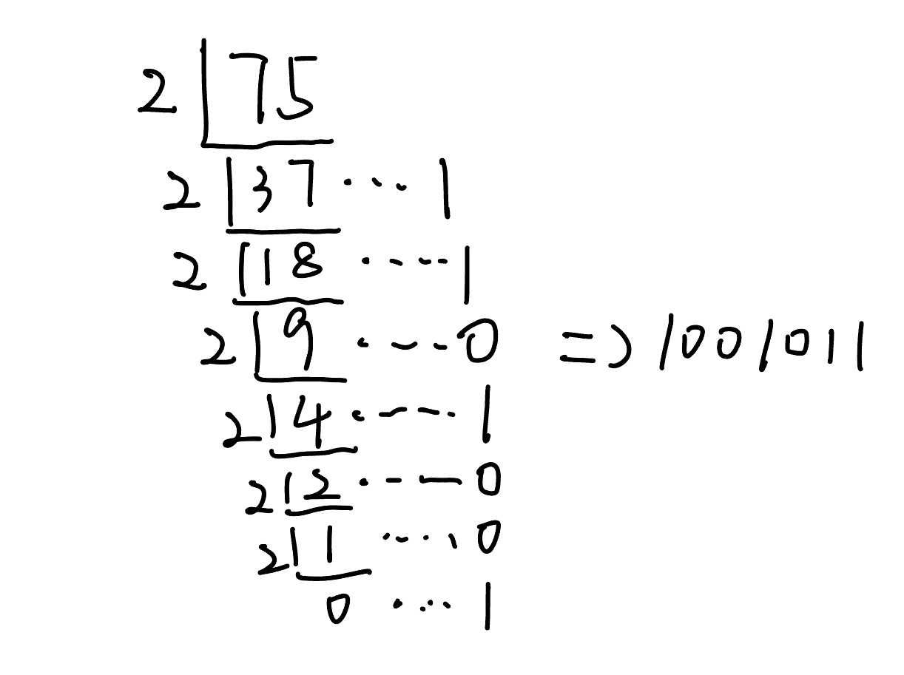
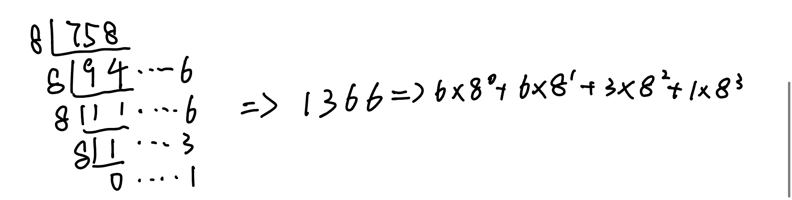
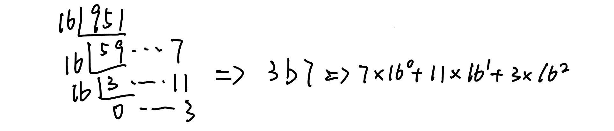
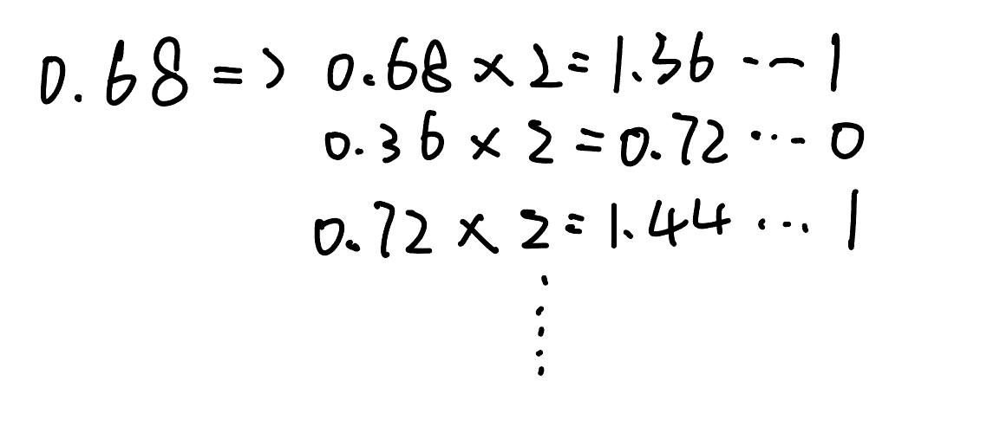
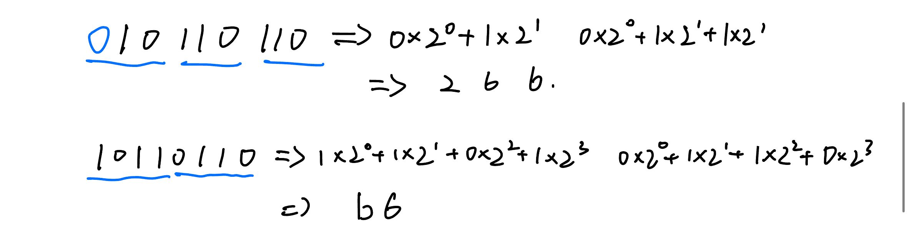
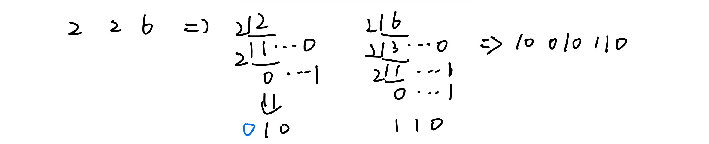
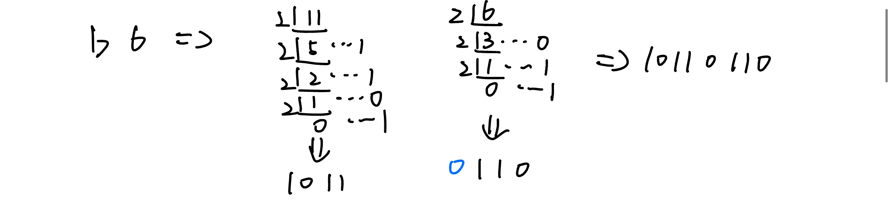

# 一.R转十与十转R

## 1.整数

### 1.二转十

>每位展开相加

### 2.十转二

>十进制数除以2，余数为权位上的数，得到商继续除以2，直到商为0终止，然后反向取余数

### 3.八进制

### 4.十六进制

## 2.小数

### 1.十转二

>乘2取整,顺序输出

### 2.二转十

>展开相加

# 二.二八十六互转

## 1.二转八,十六

>转八就划三位,转十六就划四位

## 2.八转二

>八进制数通过除2取余法，得到二进制数，对每个八进制为3个二进制

## 3.十六转二

### 4.八,十六互转

>先转十然后再转

