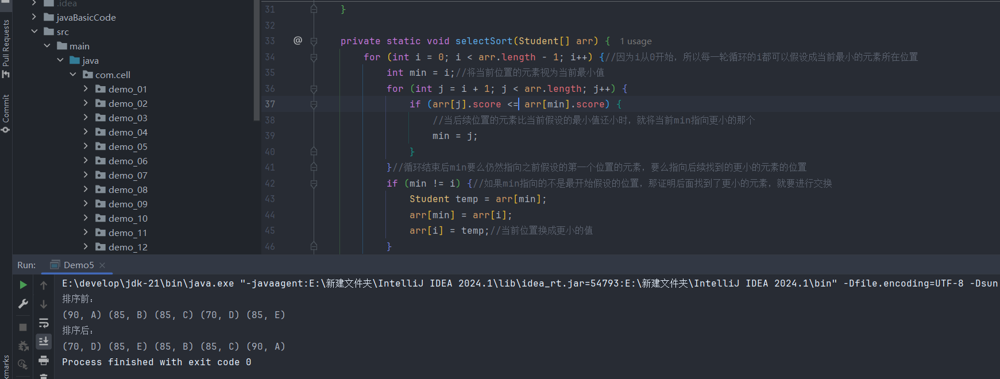

>找出参与比较的数据中的最小值，把它和第一个位置的元素互换位置，然后第一个位置的元素不参与比较，以此类推

```
初始数组：
[5, 3, 6, 2, 10]

第1轮：从索引0~4中找最小值 2，交换 arr[0] 和 arr[3]
[2, 3, 6, 5, 10]

第2轮：从索引1~4中找最小值 3，位置已正确，无需交换
[2, 3, 6, 5, 10]

第3轮：从索引2~4中找最小值 5，交换 arr[2] 和 arr[3]
[2, 3, 5, 6, 10]

第4轮：从索引3~4中找最小值 6，无需交换
[2, 3, 5, 6, 10]
```

```java
private static void selectSort(int[] arr) {  
    for (int i = 0; i < arr.length - 1; i++) {
    //因为i从0开始，所以每一轮循环的i都可以假设成当前最小的元素所在位置  
        int min = i;//将当前位置的元素视为当前最小值  
        for (int j = i + 1; j < arr.length; j++) {  
            if (arr[j] < arr[min]) {  
                //当后续位置的元素比当前假设的最小值还小时，就将当前min指向更小的那个  
                min = j;  
            }  
        }
//循环结束后min要么仍然指向之前假设的第一个位置的元素，要么指向后续找到的更小的元素的位置  
        if (min != i) {
        //如果min指向的不是最开始假设的位置，那证明后面找到了更小的元素，就要进行交换  
            int temp = arr[min];  
            arr[min] = arr[i];  
            arr[i] = temp;//当前位置换成更小的值  
        }  
    }  
}

```

>选择排序的时间复杂度是O(n<sup>2</sup>)，虽然它和冒泡排序的一样，但是在实际使用上还是更快一些的，因为冒泡排序是只要相邻的两个元素位置不对就进行交换，所以最坏情况下一轮要进行(n-1)次交换，而选择排序最坏情况也就进行一次交换

**选择排序是不稳定排序**

>当两个元素具有相同的数值时，进行选择排序后它们之间不一定仍然存在原有的前后位置关系，但是可以通过修改代码来达到稳定的目的，例如我上面写的`arr[j] < arr[min]`，即使两个数相等，它们也不会发生交换，所以这种逻辑会让选择排序变得稳定，但是它本质上仍然是不稳定的

>当把`arr[j] < arr[min]`修改成`arr[j] <= arr[min]`时就会发生前后位置不同的情况

