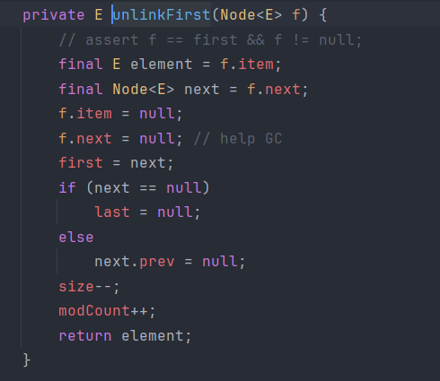

>链表是由一个一个的节点组成的，每个节点包含两个字段，其中一个字段 `data` 表示真实存储的数据，另外一个字段 `next` 表示指向下一个节点的指针，`data` 和 `next` 两者一起组成链表当中的节点( `Node` )

```java
class Node {
    int data;    // 数据域
    Node next;   // 指针域

    Node(int data) {
        this.data = data;
        this.next = null;
    }
}
```

# 1. 单向链表

```java
public class SingleLinkedList {  
    private Node head; // 链表头指针  
  
    // 构造函数，初始化为空链表  
    public SingleLinkedList() {  
        head = null;  
    }  
  
    // 头插法插入元素  
    // 最早插入的元素会变成链表的尾部元素 ... 4 3 2 1 0    
    // 每次在 head 节点的位置进行插入，插入后更新 head 节点，让刚插入的节点变成 head 节点
    public void insertAtHead(int data) {  
        Node newNode = new Node(data);  
        newNode.next = head; // 让新的节点指向头节点原来指向的节点  
        head = newNode; // 更新头节点的指向，让头节点指向新插入的节点  
    }  
  
    // 尾插法插入元素  
    public void insertAtTail(int data) {  
        Node newNode = new Node(data);  
        // 如果此时链表中没有节点，就要让头指针指向第一个添加的节点  
        // 后续插入节点就不需要动头指针了  
        if (head == null) {  
            head = newNode;  
            return;  
        }  
        // 从头节点开始向后遍历，遍历到最后一个节点后再将这个节点的指针指向新插入的节点 
        Node temp = head;  
        while (temp.next != null) {  
            temp = temp.next; // 让 temp 指针逐渐后移  
        }  
        // 当 temp 的指针为空时，证明此时的 temp 是最后一个节点  
        temp.next = newNode;  
    }  
  
    // 查找元素  
    public int search(int data) {  
        int count = 0;  
        Node temp = head;  
        while (temp != null) {  
            count++;  
            if (temp.data == data) {  
                return count;  
            } else {  
                temp = temp.next;  
            }  
        }  
        return -1;  
    }  
  
    // 删除节点  
    public void deleteByValue(int data) {  
        if (head == null) {  
            return;  
        }  
        if (head.data == data) {  
            head = head.next;  
            return;  
        }  
        // 删除节点需要将上个节点指向本节点的下个节点，所以需要创建两个临时节点  
        Node preNode = head; // 当前节点的上一个节点  
        Node currNode = head.next; // 当前节点  
        while (currNode != null) {  
            if (currNode.data == data) {  
                preNode.next = currNode.next; // 让上个节点指向当前节点的下个节点  
            }  
            // 节点后移  
            currNode = currNode.next;  
            preNode = preNode.next;  
        }  
    }  
  
    // 遍历元素  
    public void traverse() {  
        Node temp = head;  
        while (temp != null) {  
            System.out.println(temp.data);  
            temp = temp.next;  
        }  
        System.out.println("遍历结束");  
    }  
  
    // 获取链表长度  
    public int getLength() {  
        Node temp = head;  
        int length = 0;  
        while (temp != null) {  
            length++;  
            temp = temp.next;  
        }  
        return length;  
    }  
}  
  
class Node {  
    int data;    // 数据域  
    Node next;   // 指针域  
  
    // 构造函数  
    Node(int data) {  
        this.data = data;  
        this.next = null;  
    }  
}

SingleLinkedList list = new SingleLinkedList();  
list.insertAtTail(3);  
list.insertAtTail(2);  
list.insertAtTail(1);  
list.insertAtTail(4);  
list.insertAtTail(5);  
  
list.traverse(); // 3 2 1 4 5 
System.out.println("链表长度:" + list.getLength()); // 5 
  
// 查找元素  
int data = 1;  
System.out.println(data + "是第" + list.search(data) + "个元素"); 
// 1是第3个元素
  
// 删除元素  
list.deleteByValue(1);  
list.traverse(); // 3 2 4 5
```

****
# 2. 双向链表

>双向链表和单链表的区别就是它的指向有两个方向，而单链表只有一个方向，在双向链表的节点当中会有两个指向其他同样节点的变量，一个指向前一个节点，一个指向后一个节点

```java
public class DoubleLinkedList {  
    private DoubleNode head; // 链表头指针  
    private DoubleNode tail; // 链表尾指针  
  
    // 构造函数：初始化为空链表  
    public DoubleLinkedList() {  
        this.head = null;  
        this.tail = null;  
    }  
  
    // 头插法插入节点  
    public void insertAtHead(int data) {  
        DoubleNode newNode = new DoubleNode(data);  
        if (head == null) {  
            head = tail = newNode;  
        } else {  
            newNode.next = head;  
            head.prev = newNode;  
            head = newNode;  
        }  
    }  
  
    // 尾插法  
    public void insertAtTail(int data) {  
        DoubleNode newNode = new DoubleNode(data);  
        if (tail == null) {  
            head = tail = newNode;  
        } else {  
            tail.next = newNode;  
            newNode.prev = tail;  
            tail = newNode;  
        }  
    }  
  
    // 根据元素删除节点  
    public void deleteByValue(int data) {  
        if (head == null) {  
            return;  
        }  
        DoubleNode temp = head;  
        while (temp != null) {  
            if (temp.data == data) {  
                // 如果是头节点  
                if (temp == head) {  
                    head = head.next; // 将头节点后移  
                    if (head != null) {  
                        head.prev = null; // 把当前头节点的前一个节点设为空，即删除  
                    } else {  
                        tail = null; // 头节点为空说明链表为空，把尾节点也设为空  
                    }  
                }  
                // 如果是尾节点  
                else if (temp == tail) {  
                    tail = tail.prev; // 尾节点前移  
                    if (tail != null) {  
                        tail.next = null; // 将当前尾节点的后一个节点设为空，即删除  
                    }  
                }  
                // 如果是中间节点，删除 temp 节点，需要把它的前后节点的指向都修改  
                else {  
                    // 当前节点的上一个节点的 next 指向当前节点的下一个节点，  
                    // 即当前节点的下一个节点要成为当前节点的上一个节点的下一个节点  
                    temp.prev.next = temp.next;  
                    // 当前节点的下一个节点的 prev 指向当前节点的上一个节点，  
                    // 即当前节点的上一个节点要成为当前节点的下一个节点的上一个节点  
                    temp.next.prev = temp.prev;  
                }  
                return; // 只删除第一个匹配的  
            }  
            // temp 节点后移  
            temp = temp.next;  
        }  
    }  
  
    // 从头查找元素  
    public boolean searchFromHead(int data) {  
        DoubleNode temp = head;  
        while (temp != null) {  
            if (temp.data == data) {  
                return true;  
            }  
            temp = temp.next;  
        }  
        return false;  
    }  
  
    // 从尾查找元素  
    public boolean searchFromTail(int data) {  
        DoubleNode temp = tail;  
        while (temp != null) {  
            if (temp.data == data) {  
                return true;  
            }  
            temp = temp.prev;  
        }  
        return false;  
    }  
  
    // 正向遍历链表  
    public void traverseForward() {  
        DoubleNode temp = head;  
        while (temp != null) {  
            System.out.print(temp.data + "<->");  
            temp = temp.next;  
        }  
        System.out.println("遍历结束");  
    }  
  
    // 反向遍历  
    public void traverseBackward() {  
        DoubleNode temp = tail;  
        while (temp != null) {  
            System.out.print(temp.data + "<->");  
            temp = temp.prev;  
        }  
        System.out.println("遍历结束");  
    }  
  
    // 获取链表长度  
    public int getLength() {  
        int length = 0;  
        DoubleNode temp = head;  
        while (temp != null) {  
            length++;  
            temp = temp.next;  
        }  
        return length;  
    }  
}  
  
class DoubleNode {  
    int data;           // 数据域  
    DoubleNode prev;    // 前一个节点指针  
    DoubleNode next;    // 后一个节点指针  
  
    public DoubleNode(int data) {  
        this.data = data;  
        this.prev = null;  
        this.next = null;  
    }  
}

DoubleLinkedList list = new DoubleLinkedList();  
list.insertAtHead(3);  
list.insertAtHead(2);  
list.insertAtHead(1);  
list.insertAtTail(4);  
list.insertAtTail(5);  
  
System.out.println("正向遍历：");  
list.traverseForward();  // 1 <-> 2 <-> 3 <-> 4 <-> 5 <-> 遍历结束  
  
System.out.println("反向遍历：");  
list.traverseBackward(); // 5 <-> 4 <-> 3 <-> 2 <-> 1 <-> 遍历结束  
  
System.out.println("链表长度：" + list.getLength()); // 输出 5  
System.out.println("查找元素4：" + list.searchFromHead(4)); // true  
System.out.println("查找元素6：" + list.searchFromTail(6)); // false  
  
list.deleteByValue(3); // 删除元素3  
System.out.println("删除3后的正向遍历：");  
list.traverseForward(); // 1 <-> 2 <-> 4 <-> 5 <-> 遍历结束
```

>和单向链表的代码比较一下，在初始化时需要添加一个尾节点，当添加了两个节点后才能体现出区别，但是尾节点不是必须的，只是添加了尾节点后可以从尾部开始操作，让双向链表的特点得到发挥，最典型的就是尾插法，直接在尾节点后面添加就行，不需要像单向链表一样遍历到尾部

****
# 3. 单向循环链表

>它和普通单向链表的最大区别是最后一个节点的 `next` 不再是 `null`，而是指向头节点， 因此它形成了一个闭环结构，可以循环遍历

```java
public class CircularLinkedList {  
    private Node head;  
    private Node tail;  
  
    public CircularLinkedList() {  
        this.head = null;  
        this.tail = null;  
    }  
  
    // 头插法插入元素  
    public void insertAtHead(int data) {  
        Node newNode = new Node(data);  
        // 让尾指针指的下一个节点指向新的头节点  
        if (head == null) {  
            head = tail = newNode;  
        } else {  
            newNode.next = head;  
            head = newNode;  
        }  
        tail.next = head; // 成环  
    }  
  
    // 尾插法插入元素  
    public void insertAtTail(int data) {  
        Node newNode = new Node(data);  
        // 将新的尾指针的下一个节点指向头节点  
        if (head == null) {  
            head = tail = newNode;  
        } else {  
            tail.next = newNode;  
            tail = newNode;  
        }  
        tail.next = head;  
    }  
  
    // 根据值删除节点  
    public void deleteByValue(int data) {  
        if (head == null) return;  
        if (head.data == data) {  
            if (head == tail) {  
                head = tail = null;  
            } else {  
                head = head.next; // head 后移  
                tail.next = head; // 指向新的头节点  
            }  
            return;  
        }  
        Node prev = head;  
        Node curr = head.next;  
        while (curr != head) {  
            if (curr.data == data) {  
                prev.next = curr.next;  
                if (curr == tail) {  
                    // 如果当前节点是尾节点就让上一个节点充当新的尾节点  
                    tail = prev;  
                    tail.next = head;  
                }  
                return;  
            }  
            prev = curr;  
            curr = curr.next;  
        }  
    }  
  
    // 遍历链表  
    public void traverse() {  
        if (head == null) return;  
        Node curr = head;  
        do {  
            System.out.print(curr.data + "->");  
            curr = curr.next;  
        } while (curr != head);  
        System.out.println("(回到头部)");  
    }  
  
    // 查找某个元素  
    public boolean search(int data) {  
        if (head == null) return false;  
        Node curr = head;  
        do {  
            if (curr.data == data) {  
                return true;  
            }  
            curr = curr.next;  
        } while (curr != head);  
        return false;  
    }  
  
    // 获取链表长度  
    public int getLength() {  
        if (head == null) return 0;  
        int length = 0;  
        Node curr = head;  
        do {  
            length++;  
            curr = curr.next;  
        } while (curr != head);  
        return length;  
    }  
}

CircularLinkedList list = new CircularLinkedList();  
list.insertAtTail(1);  
list.insertAtTail(2);  
list.insertAtTail(3);  
list.insertAtHead(0);  
  
System.out.println("遍历链表：");  
list.traverse(); // 0 -> 1 -> 2 -> 3 -> (回到头部)  
  
System.out.println("查找 2：" + list.search(2)); // true  
System.out.println("查找 9：" + list.search(9)); // false  
  
System.out.println("链表长度：" + list.getLength()); // 4  
  
list.deleteByValue(3);  
System.out.println("删除 3 后遍历："); 
list.traverse(); // 0->1->2->(回到头部) 
```

>主要就是要记得让尾指针的下一个节点是头指针

****
# 4. 双向循环链表

- 每个节点有两个指针：`next` 指向后一个节点，`prev` 指向前一个节点。
- **头节点的 `prev` 指向尾节点**，尾节点的 `next` 指向头节点，实现循环。
- 删除、插入时，要同时维护 `prev` 和 `next` 两条链。
- 空链表插入时，`head` 和 `tail` 都指向新节点，新节点的 `next` 和 `prev` 都指向自己

```java
 public class DoubleCircularLinkedList {  
    private DoubleNode head;  
    private DoubleNode tail;  
  
    public DoubleCircularLinkedList() {  
        this.head = null;  
        this.tail = null;  
    }  
  
    // 头插法插入元素  
    public void insertAtHead(int data) {  
        DoubleNode newNode = new DoubleNode(data);  
        if (head == null) {  
            head = tail = newNode;  
            head.prev = tail;  
            tail.next = head;  
        } else {  
            newNode.next = head;  
            head.prev = newNode;  
            newNode.prev = tail;  
            tail.next = newNode;  
            head = newNode;  
        }  
    }  
  
    // 尾插法插入元素  
    public void insertAtTail(int data) {  
        DoubleNode newNode = new DoubleNode(data);  
        if (head == null) {  
            head = tail = newNode;  
            head.prev = tail;  
            tail.next = head;  
        } else {  
            newNode.prev = tail;  
            tail.next = newNode;  
            tail = newNode;  
            head.prev = tail;  
            tail.next = head;  
        }  
    }  
  
    // 根据值删除节点  
    public void deleteByValue(int data) {  
        if (head == null) return;  
        DoubleNode curr = head;  
        do {  
            if (curr.data == data) {  
                if (curr == head && curr == tail) {  
                    head = tail = null;  
                } else if (curr == head) {  
                    head = head.next;  
                    head.prev = tail;  
                    tail.next = head;  
                } else if (curr == tail) {  
                    tail = tail.prev;  
                    tail.next = head;  
                    head.prev = tail;  
                } else {  
                    curr.prev.next = curr.next;  
                    curr.next.prev = curr.prev;  
                }  
                return;  
            }  
            curr = curr.next;  
        } while (curr != head);  
    }  
  
    // 从头开始遍历  
    public void traverseForward() {  
        if (head == null) return;  
  
        DoubleNode curr = head;  
        do {  
            System.out.print(curr.data + "<->");  
            curr = curr.next;  
        } while(curr != head);  
        System.out.println("回到头部");  
    }  
  
    // 从尾开始遍历  
    public void traverseBackward() {  
        if (tail == null) return;  
  
        DoubleNode curr = tail;  
        do {  
            System.out.print(curr.data + "<->");  
            curr = curr.prev;  
        } while (curr != tail);  
        System.out.println("回到尾部");  
    }  
  
    // 查找元素  
    public boolean search(int data) {  
        if (head == null) return false;  
        DoubleNode curr = head;  
        do {  
            if (curr.data == data) {  
                return true;  
            }  
            curr = curr.next;  
        } while (curr != head);  
        return false;  
    }  
  
    // 获取链表长度  
    public int getLength() {  
        if (head == null) return 0;  
        int length = 0;  
        DoubleNode curr = head;  
        do {  
            length++;  
            curr = curr.next;  
        } while (curr != head);  
        return length;  
    }  
}


DoubleCircularLinkedList list = new DoubleCircularLinkedList();  
  
list.insertAtHead(3);  
list.insertAtHead(2);  
list.insertAtHead(1);  
list.insertAtTail(4);  
list.insertAtTail(5);  
list.traverseForward(); // 1<->2<->3<->4<->5<->回到头部 
list.traverseBackward(); // 5<->4<->3<->2<->1<->回到尾部  
  
System.out.println("\n删除节点3：");  
list.deleteByValue(3);  
list.traverseForward(); // 1<->2<->4<->5<->回到头部  
  
System.out.println("\n删除节点2：");  
list.deleteByValue(2);  
list.traverseForward(); // 1<->4<->5<->回到头部 
  
System.out.println("\n删除节点5：");  
list.deleteByValue(5);  
list.traverseForward(); // 1<->4<->回到头部 
  
System.out.println("\n查找元素：");  
System.out.println("查找4: " + list.search(4)); // true  
System.out.println("查找2: " + list.search(2)); // false  
  
System.out.println("\n链表长度：");  
System.out.println(list.getLength());  // 2
```

****
# 5. 静态链表

>静态链表和前面提到的链表不一样，它是使用数组来实现链表，只是将 `next` 变成一个`int`类型的数据，表示下一跳数据的下标，比如下图当中所表示的那样（其中-1表示链表的结尾，因为 `next` 域存储的是下一个节点的下标，下标肯定大于等于0，因此可以使用-1表示链表的结尾）：


>因为它本质上是一种数组，所以它的大小在编译时就会确定好，不能动态分配内存

```java
private static class Node {  
    int data;  
    int next;  
}  
private Node[] nodes;  // 节点数组  
private int head;      // 有效链表的头节点索引  
private int free;      // 空闲链表的头节点索引
```

>初始化静态链表，先初始化 `nodes[]` 数组，然后对 `nodes[]` 数组的 `next` 字段赋值，让它存储下一个数组元素的下标，以此作为指向下一个元素的指针

```java
public StaticLinkedList(int capacity) {  
    nodes = new Node[capacity];  
    for (int i = 0; i < capacity; i++) {  
        nodes[i] = new Node();  
    }  
    head = 0; // 初始有效链表为空  
    free = 1; // 空闲链表从索引1开始  
  
    // 初始化空闲链表  
    for (int i = 1; i < capacity - 1; i++) {  
        nodes[i].next = i + 1;  
    }  
    nodes[capacity - 1].next = 0; // 最后一个空闲节点  
}
```

****

**插入元素**

>头插法，移动 `head` 指针和 `free` 指针，0 号下标作为结束标志，不在这里存放数据，所以先从 1 号下标开始添加元素，

```java
// 在链表头部插入数据  
public void insert(int data) {  
    if (free == 0) {  
        System.out.println("空间已满");  
        return;  
    }  
    int newIndex = free; // 从空闲链表中拿一个节点   
    nodes[newIndex].data = data; // 填入数据  
    free = nodes[newIndex].next; // 更新空闲链表表头，即后移一位 
    nodes[newIndex].next = head; // 从头部插入  
    head = newIndex; // 更新有效链表头节点  
}
```

>从 `free` 指向的位置开始添加数据，然后移动 `free` ，因为最早初始化时每个元素的 `next` 字段指向的都是相邻的后一个元素的下标，所以 `free` 可以看作是后移一位，然后将添加完数据的那个位置的 `next` 字段指向上一次 `head` 指向的地方，因为 `head` 的初始值设置为 0 ，所以第一次添加的元素的 `next` 指向了 0 ，也对应了最后一个元素的 `next` 应该指向 0 这个条件，后面再进行添加操作时，都是先后移 `free` ，然后调整 `next` 指向上一次 `head` 的位置，然后再更新 `head` 指向当前位置，以此类推，主要是要理解下面画的过程图


>和动态链表的头插法有点不同，动态链表的头插法插完只需移动 `head` 即可，而静态链表还需要移动 `free` 来判断是否到达容器的最大容量，根据过程图来看更像是动态链表的尾插法，所以整体静态链表会更复杂一点

****

**删除节点**

```java
public void delete(int data) {  
    int prev = 0; // 记录上一个有效节点的位置  
    int curr = head; // 头节点为数组的最后一个元素  
    while (curr != 0) {  
        if (data == nodes[curr].data) {  
            if (prev == 0) {  
                head = nodes[curr].next; // 删除有效链表的头节点  
            } else {  
                nodes[prev].next = nodes[curr].next;  
            }  
            // 回收到空闲链表  
            nodes[curr].next = free;  
            free = curr;  
            return;  
        }  
        prev = curr;  
        curr = nodes[curr].next;  
    }  
}
```

>删除节点的遍历有点像倒序遍历，从数组的末尾开始向前遍历（插入的最新元素为 `head` ），所以要引入 `prev` 来判断当前的头节点是否为待删除的元素

****

**遍历静态链表**

```java
public void traverse() {  
    int curr = head;  
    while (curr != 0) {  
        System.out.print(nodes[curr].data + " -> ");  
        curr = nodes[curr].next;  
    }  
    System.out.println("null");  
}
```

>从插入的新元素开始遍历，每输出一个元素后便向前移动一位

>只是因为数组不能改变位置的原因，所以导致看上去很像倒序遍历，因为 `head` 此时是指向尾部元素的，但是和单向链表的输出对比一下还是一样的，输出的内容也是颠倒的

****
# 6. LinkedList


>可以看到 `LinkedList` 有三个字段，一个记录链表大小，另外两个记录头尾指针，每个节点都具有前驱与后继，所以它是双向链表

## 6.1 新增操作原码


>通过 `debug` 可以看到 `add()` 方法调用的是尾插法，第一次添加时链表中没有数据 ，所以 `last == null`，给 l 和 newNode 加上 `final` 修饰也是为了防止被意外篡改，因为创建的节点是具有前驱与后继的，所以初始化新节点时要填入前驱与后继的指向，即前驱指向上一个尾节点，新插入的节点作为新的尾节点，所以后继要指向 null ，所以一个节点总共包含三个引用，一个指向本身，一个指向上一个节点（指向上一个节点本身的引用），一个指向下一个节点（指向下一个节点本身的引用）

****
## 6.2 修改操作


>修改操作会通过下标获取到当前位置的元素，也就是 `node(index)` 方法，因为 `LinkedList` 是一个双向链表，所以可以判断下标的位置，看它接近头部还是尾部，然后再遍历，这样可以节省点时间，


>找到对应下标的元素后用 `oldVal` 接收，然后返回，所以通过修改后的输出结果是原始的值

****
## 6.3 删除操作



>因为这个原码是删除头节点的元素，所以需要重新设置头节点和后继

****