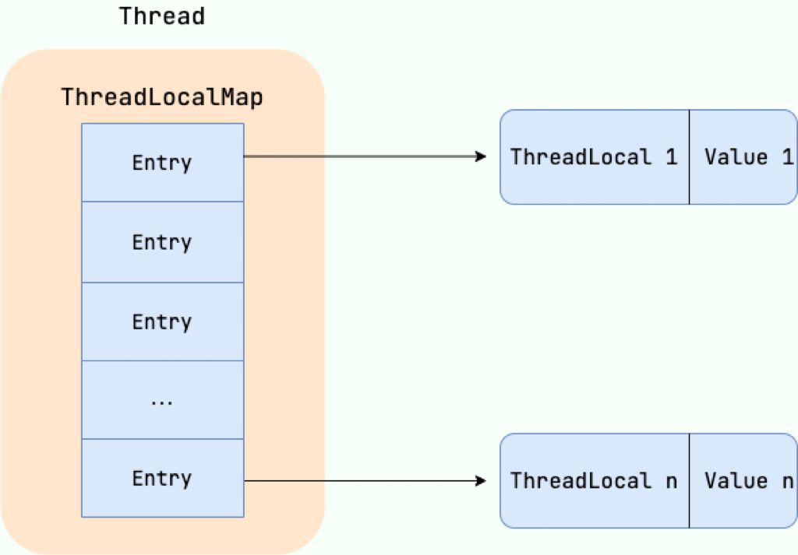
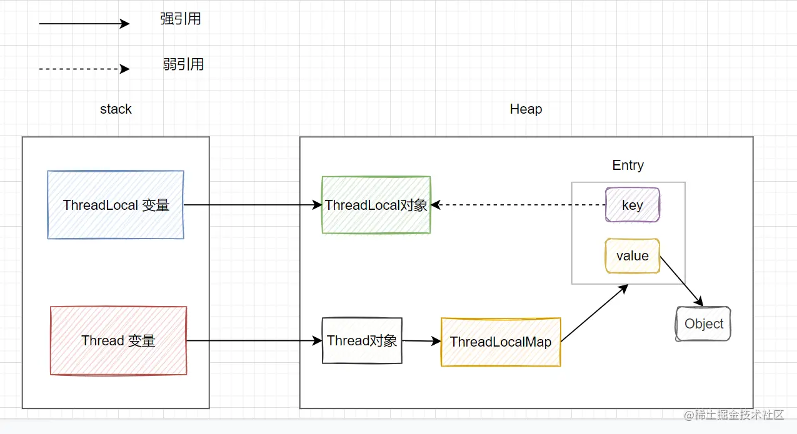

# 1. ThreadLocal

## 1.1 ThreadLocal 有什么用

>`ThreadLocal` 提供了一个线程本地变量，每个线程都有一个自己独立的、初始化的变量副本。线程可以访问和修改自己的副本，而不会与其他线程的副本产生冲突。可以把它理解为一个以线程为 key，以存入的值为 value 的映射（Map）。每个线程通过 `ThreadLocal` 对象只能访问到映射给自己线程的那个值。

而 `ThreadLocal` 的核心价值在于 “线程隔离”，它解决了变量在线程间共享的问题，而是为每个线程创建了一份独立的实例。当创建一个 `ThreadLocal` 变量时，每个访问该变量的线程都会拥有一个独立的副本。线程可以通过 `get()` 方法获取自己线程的本地副本，或通过 `set()` 方法修改该副本的值，从而避免了线程安全问题。

主要用途：

1、存储线程上下文信息

这是 `ThreadLocal` 最常用的，在一个线程执行的上下文中，多个方法或组件可能需要访问同一个信息，但如果将这个信息作为参数在方法间层层传递，会导致代码冗余且难以维护。

```java
public class UserContextHolder {
    // 创建一个ThreadLocal变量，用于存储User对象
    private static final ThreadLocal<User> currentUser = new ThreadLocal<>();
    
    public static void set(User user) {
    currentUser.set(user);
	}
	
	public static User get() {
	    return currentUser.get();
	}
    
    // 使用完后必须清除，防止内存泄漏
    public static void remove() {
        currentUser.remove();
    }
}

// 在 Filter 中
public void doFilter(ServletRequest request, ServletResponse response, FilterChain chain) {
    try {
	    // 获取用户信息
        User user = (User) request.getSession().getAttribute("user"); 
        UserContextHolder.set(user); // 存入ThreadLocal
        chain.doFilter(request, response);
    } finally {
        UserContextHolder.remove(); // 确保请求处理后一定清除
    }
}

// 在 Service 中，可以直接获取，无需方法参数传递
@Service
public class SomeService {
    public void someBusinessMethod() {
        User user = UserContextHolder.get(); // 直接获取当前用户
        System.out.println("Current user is: " + user.getName());
        // ... 业务逻辑
    }
}
```

2、避免在方法间传递通用参数

对于一些需要贯穿多个方法层级的通用参数，使用 `ThreadLocal` 可以极大地简化代码，避免出现 `methodA(String traceId, Param p)` -> `methodB(String traceId, Param p)` 这样的 “噪音” 参数。

3、提供线程安全的工具对象

有些类本身不是线程安全的（如 `SimpleDateFormat`），但如果每个线程都创建一个新的实例，开销会很大。使用 `ThreadLocal` 可以让每个线程只创建并共享一个自己的实例，既保证了线程安全，又避免了重复创建的开销。

```java
public class DateUtils {
    private static final ThreadLocal<SimpleDateFormat> DATE_FORMATTER =
        ThreadLocal.withInitial(() -> new SimpleDateFormat("yyyy-MM-dd"));
    
    public static String format(Date date) {
        return DATE_FORMATTER.get().format(date);
    }
}
// 每个线程调用 format 时，使用的都是自己线程的 SimpleDateFormat 实例，安全、高效。
```

****
## 1.2 ThreadLocal 原理

```java
public class Thread implements Runnable {
    // ...
    // 与此线程有关的 ThreadLocal 值，由 ThreadLocal 类维护 
    ThreadLocal.ThreadLocalMap threadLocals = null;
    // 与此线程有关的 InheritableThreadLocal 值，由 InheritableThreadLocal 类维护 
    ThreadLocal.ThreadLocalMap inheritableThreadLocals = null;
    // ...
}
```

`Thread` 类内部持有一个名为 `threadLocals` 的 `ThreadLocalMap` 类型的成员变量，而 `ThreadLocalMap` 是 `ThreadLocal` 的一个**静态内部类**，它才是一个真正的键值对存储结构。它的Key 是 `ThreadLocal` 对象本身（弱引用），Value 是你存储的值。

| 类型                         | 强度  | 是否可被 GC 回收   | 典型用途                                   |
| -------------------------- | --- | ------------ | -------------------------------------- |
| **强引用（Strong Reference）**  | 最强  | 不可回收         | 普通对象引用，例如 `Object obj = new Object();` |
| **软引用（Soft Reference）**    | 较强  | 内存不足时回收      | 缓存系统，保证尽可能不被回收                         |
| **弱引用（Weak Reference）**    | 较弱  | 一旦 GC，就会回收   | ThreadLocalMap 的 key、弱引用队列、对象登记表       |
| **虚引用（Phantom Reference）** | 最弱  | 用于在对象被回收前做清理 | 垃圾回收前通知，ReferenceQueue 使用              |
所以，整个关系是这样的：

- 每个 `Thread` 都有一个自己独有的 `ThreadLocalMap`。
- 这个 `Map` 的 Key 是各个 `ThreadLocal` 变量。
- 这个 `Map` 的 Value 就是通过 `threadLocal.set(value)` 存储的值。

```java
public void set(T value) {
    // 1. 获取当前正在执行的线程
    Thread t = Thread.currentThread();
    // 2. 获取这个线程自己的 ThreadLocalMap
    ThreadLocalMap map = getMap(t);
    // 3. 如果 Map 不为空，直接将当前 ThreadLocal 对象作为 Key，要存的值作为 Value 放进去
    if (map != null) {
        map.set(this, value);
    } else {
        // 4. 如果 Map 还没初始化，则创建一个新的 ThreadLocalMap 并赋值给线程的  threadLocals 变量
        createMap(t, value);
    }
}

ThreadLocalMap getMap(Thread t) {
    return t.threadLocals; // 直接返回线程的成员变量
}

void createMap(Thread t, T firstValue) {
    t.threadLocals = new ThreadLocalMap(this, firstValue);
}
```

```java
public T get() {
    // 1. 获取当前线程
    Thread t = Thread.currentThread();
    // 2. 获取线程的 ThreadLocalMap
    ThreadLocalMap map = getMap(t);
    // 3. 如果 Map 已存在
    if (map != null) {
        // 以当前 ThreadLocal 为 Key，尝试获取对应的键值对（Entry）
        ThreadLocalMap.Entry e = map.getEntry(this);
        // 4. 如果找到了，返回 Value
        if (e != null) {
            @SuppressWarnings("unchecked")
            T result = (T)e.value;
            return result;
        }
    }
    // 5. 如果 Map 不存在或者没找到值，则调用初始化方法并返回初始值，默认为 null
    return setInitialValue();
}
```

通过上面这些内容，足以得出结论：最终的变量是放在了当前线程的 `ThreadLocalMap` 中，并不是存在 `ThreadLocal` 上，`ThreadLocal` 可以理解为只是 `ThreadLocalMap` 的封装，传递了变量值。 `ThrealLocal` 类中可以通过 `Thread.currentThread()` 获取到当前线程对象后，直接通过`getMap(Thread t)` 访问到该线程的 `ThreadLocalMap` 对象。每个 `Thread` 中都具备一个`ThreadLocalMap`，而` ThreadLocalMap` 可以存储以 `ThreadLocal` 为 key ，Object 对象为 value 的键值对。

```java
ThreadLocalMap(ThreadLocal<?> firstKey, Object firstValue) {
    //......
}
```

比如在同一个线程中声明了两个 `ThreadLocal` 对象的话， `Thread` 内部都是使用仅有的那个`ThreadLocalMap` 存放数据的，`ThreadLocalMap` 的 key 就是 `ThreadLocal` 对象，value 就是 `ThreadLocal` 对象调用 `set` 方法设置的值。



****
## 1.3 ThreadLocal 内存泄露

