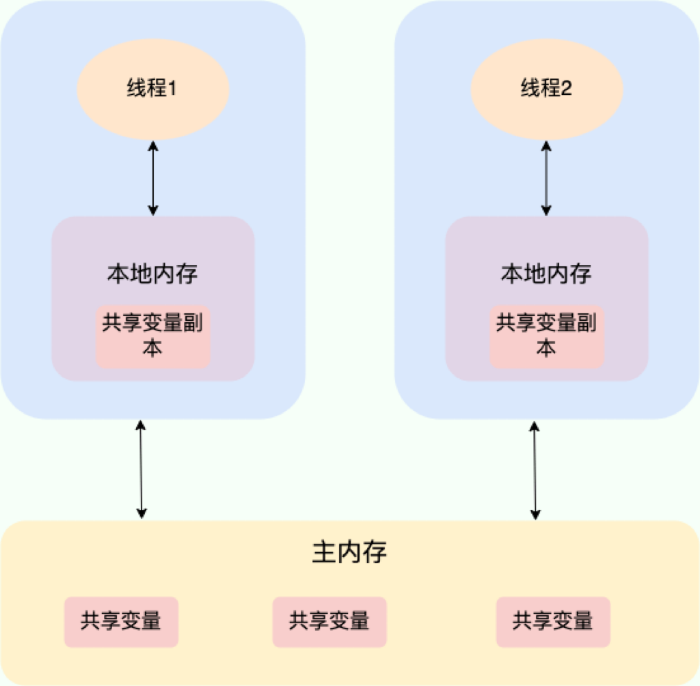
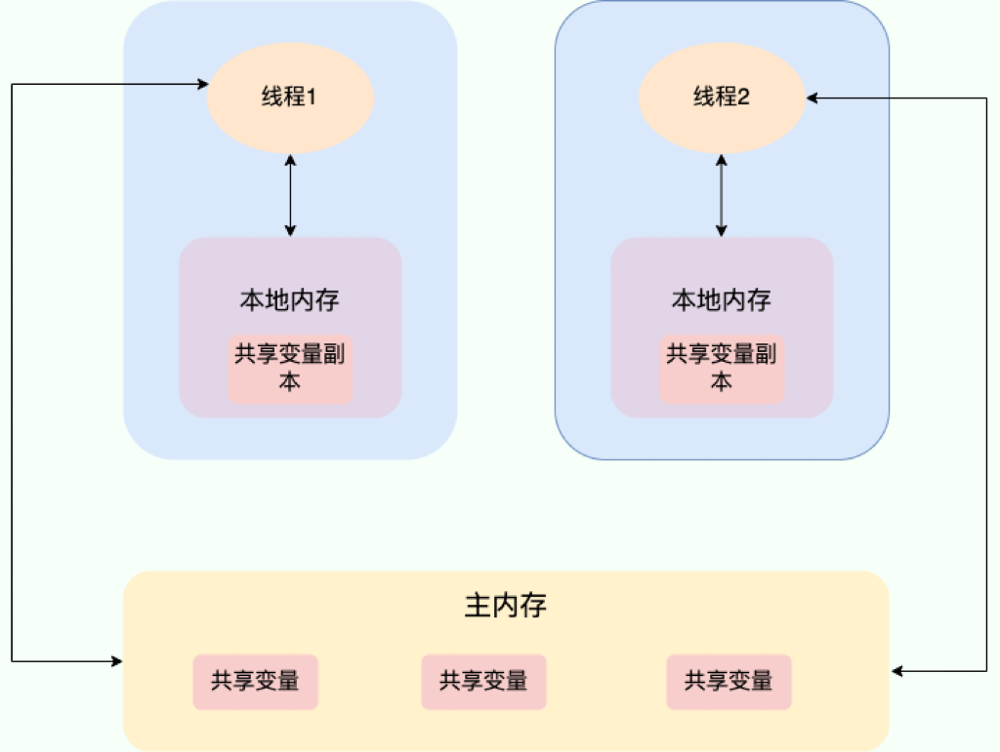

# 1. volatile 关键字

## 1.1 如何保证变量的可见性

>在多线程环境下，每个线程都有自己的[工作内存](多线程.md#11.2.1%20两个内存)（CPU 缓存），线程对变量的操作先在工作内存中进行，主内存中的变量值可能未被及时更新。所以一个线程对变量的修改，其他线程可能看不到，出现数据不同步的问题。

而 `volatile` 的作用就是保证可见性，当一个变量被 `volatile` 修饰后，线程对该变量的写操作会立刻刷新回主内存，并且线程对该变量的读操作，会直接从主内存中读取，而不是从工作内存缓存中读取，这样就保证了一个线程修改了变量，其他线程马上能看到修改后的最新值。





Java 内存模型（JMM）对 `volatile` 有如下要求：

- 禁止指令重排序优化：对 `volatile` 变量的读写操作不会被重排序，以此保证操作顺序。
- 内存屏障：编译器和 CPU 会在 `volatile` 变量的读写前后插入内存屏障，确保：
    - 写 `volatile` 变量之前的操作必须先执行，写操作会立刻刷新到主内存。
    - 读 `volatile` 变量之后的操作必须后执行，读操作必须从主内存加载最新值。

```java
private volatile boolean flag = false;

Thread A:
    flag = true; // 写操作，立刻刷新到主内存

Thread B:
    while (!flag) {
        // 如果 flag 不是 volatile，可能一直读缓存，死循环
        // 如果 flag 是 volatile，能及时看到 flag 变为 true，跳出循环
    }
```

但需要注意的是：`volatile` 只能保证可见性，不保证原子性。例如：

```java
volatile int count = 0;
count++;
// 以下整组操作不是原子的，分别为读-改-写三步
int temp = count; // 读取 volatile count（从主内存读取）  
temp = temp + 1; // 自增
count = temp; // 写回 volatile count（写回主内存）
```

所以即使 `count` 由 `volatile` 修饰，但多个线程同时执行 `count++` 依然会导致数据竞争。若既需要保证数据的可见性，又需要操作的原子性，就可以使用 `synchronized`，进入 `synchronized` 的线程，一定能看到其他线程对同一锁保护下共享变量的修改，因为当一个线程进入 `synchronized` 的[临界区](多线程.md#12.%20synchronized)时，会清空本地工作内存（线程栈中的变量副本），并从主内存中重新读取共享变量的值。当线程退出同步块（释放锁）时，会把对共享变量的修改刷新回主内存，确保别的线程能看到这些变化。

****
## 1.2 volatile 如何禁止指令重排

JVM 和 CPU 为了优化程序执行效率，会对指令进行重排序，因为一个汇编指令也会涉及到很多步骤，每个步骤可能会用到不同的寄存器，也就是说，CPU 有多个功能单元（如获取、解码、运算和结果），一条指令也分为多个单元，那么第一条指令执行还没完毕，就可以执行第二条指令，前提是这两条指令功能单元相同或类似，所以一般可以通过指令重排使得具有相似功能单元的指令接连执行来减少流水线中断的情况。例如：

```java
int a = 1;
int b = 1;
a = a + 1;
b = b +1 ;
```

```java
int a = 1;
a = a + 1;
int b = 1;
b = b +1 ;
```

前者的性能可能就优于后者，因为如果局部变量连续声明使用，有可能在编译器优化时更容易保持寄存器命中，减少从栈读取。

当声明一个 `volatile` 变量时，JVM 会在编译后插入内存屏障指令来约束指令的重排序。在 Java 中，`Unsafe` 类提供了三个内存屏障相关的方法：

```java
// 屏蔽之后的所有读操作被重排到该屏障之前，等价于读取屏障（LoadLoad）
public native void loadFence();
// 屏蔽之前的所有写操作被重排到该屏障之后，等价于写入屏障（StoreStore）
public native void storeFence();
// 屏蔽所有读写操作的重排，等价于读写全屏障（LoadLoad + StoreStore + StoreLoad）
public native void fullFence();
```

- `loadFence()`：读不能穿透
- `storeFence()`：写不能穿透
- `fullFence()`：读写都不能穿透

`volatile` 与内存屏障的关系：

```java
// 写 volatile 变量
store to memory
storeStore barrier
write to volatile variable
storeLoad barrier

// 读 volatile 变量
read from volatile variable
loadLoad barrier
load from memory
```

具体内存指令：

- 在每个 `volatile` 写操作的前面插入一个 StoreStore 屏障，确保前面的普通写操作（非 volatile）在内存中对其他线程可见之后，才执行 `volatile` 变量的写

```java
sharedData = 123; // 普通变量
flag = true; // volatile 变量
```

如果没有 StoreStore 屏障，CPU 可能会重排序为：

```java
flag = true;
sharedData = 123;
```

- 在每个 `volatile` 写操作的后面插入一个 StoreLoad 屏障，防止 `volatile` 写与后续的任何读/写操作发生重排序

```java
// 确保写入后，所有线程读取到 object 时，它的字段已经初始化完成
object = new MyObject(); // volatile 写
```

- 在每个 `volatile` 读操作的后面插入一个 LoadLoad 屏障，防止在 `volatile` 读之后的普通读操作被重排序到 volatile 读之前

```java
boolean f = flag; // volatile 读
// 防止 CPU 把 x = sharedData 提前到 f = flag 之前执行
int x = sharedData; // 普通读
```

- 在每个 `volatile` 读操作的后面插入一个 LoadStore 屏障，防止 `volatile` 读操作之后的普通写被重排序到 volatile 读之前

```java
boolean f = flag; // volatile 读
// 防止 sharedData = 123 提前到 flag 被读取之前执行
sharedData = 123; // 普通写
```

也就是说，`volatile` 变量的读写操作底层实际通过插入内存屏障来实现可见性，从而控制 JVM 与 CPU 的缓存一致性。

****
## 1.3 volatile 可以保证原子性吗

>`volatile` 关键字能保证变量的可见性，但不能保证对变量的操作是原子性的。

```java
public class VolatileAtomicityDemo {
    public volatile static int inc = 0;

    public void increase() {
        inc++;
    }

    public static void main(String[] args) throws InterruptedException {
        ExecutorService threadPool = Executors.newFixedThreadPool(5);
        VolatileAtomicityDemo volatileAtomicityDemo = new VolatileAtomicityDemo();
        for (int i = 0; i < 5; i++) {
            threadPool.execute(() -> {
                for (int j = 0; j < 500; j++) {
                    volatileAtomicityDemo.increase();
                }
            });
        }
        // 等待 1.5 秒，保证上面程序执行完成
        Thread.sleep(1500);
        System.out.println(inc);
        threadPool.shutdown();
    }
}
```

正常情况应该是五个线程都对 `inc` 累加 500 次，所以最终输出应该为 2500，但实际输出不足 2500，可见 `volatile` 无法保证原子性。实际上，`inc++` 其实是一个复合操作，包括三步：

1. 读取 inc 的值
2. 对 inc 加 1
3. 将 inc 的值写回内存

`volatile` 是无法保证这三个操作是具有原子性的，有可能导致下面这种情况出现：

1. 线程 1 对 `inc` 进行读取操作之后，还未对其进行修改。线程 2 又读取了 `inc`的值并对其进行修改（+1），再将`inc` 的值写回内存
2. 线程 2 操作完毕后，线程 1 对 `inc`的值进行修改（+1），再将`inc` 的值写回内存

这也就导致两个线程分别对 `inc` 进行了一次自增操作后，`inc` 实际上只增加了 1。其实，如果想要保证上面的代码运行正确也非常简单，利用 `synchronized`、`Lock` 就可以了。

****
# 2. 乐观锁和悲观锁

>当程序中可能出现并发的情况时，就需要通过一定的手段来保证在并发情况下数据的准确性，通过这种手段保证了当前用户和其他用户一起操作时，所得到的结果和他单独操作时的结果是一样的。这种手段就叫做并发控制，并发控制的目的是保证一个用户的工作不会对另一个用户的工作产生不合理的影响，而实现并发控制的主要手段大致可以分为乐观并发控制和悲观并发控制两种。

## 2.1 什么是悲观锁

悲观锁总是假设最坏的情况，认为共享资源每次被访问的时候就会出现问题（比如共享数据被修改
），所以每次在获取资源操作的时候都会上锁，这样其他线程想拿到这个资源就会阻塞直到锁被上一个持有者释放。也就是说，共享资源每次只给一个线程使用，其它线程阻塞，用完后再把资源转让给其它线程。这种借助锁机制在修改数据之前先锁定，然后再修改的方式被称为悲观并发控制（又名“悲观锁”）。像 Java 中` synchronized` 和 `ReentrantLock` 等独占锁就是悲观锁思想的实现。

但是在效率方面，处理加锁的机制会让数据库产生额外的开销，还有增加产生死锁的机会；另外，还会降低并行性，一个事务如果锁定了某行数据，其他事务就必须等待该事务处理完才可以处理那行数据。

****
## 2.2 什么是乐观锁

乐观锁总是假设最好的情况，认为共享资源每次被访问的时候都不会出现问题，线程可以不停地执行，无需加锁也无需等待，只是在提交修改的时候去验证对应的资源（数据）是否被其它线程修改了。相对于悲观锁，乐观锁在对数据库进行处理的时候并不会使用锁机制，一般的实现乐观锁的方式就是记录数据版本。

乐观并发控制相信事务之间的数据竞争的概率是比较小的，因此尽可能直接做下去，直到提交的时候才去锁定，所以不会产生任何锁和死锁。

****
## 2.3 如何实现乐观锁

乐观锁一般会使用版本号机制或 CAS 算法实现，但 CAS 算法相对来说更多一些。

### 2.3.1 版本号机制

一般是在数据表中加上一个数据版本号 `version` 字段，表示数据被修改的次数，当数据被修改时对 `version` 进行累加。当线程 A 要更新数据值时，在读取数据的同时也会读取 `version` 值，在提交更新时，再查询一次 `version` 值，只有此时的 `version` 值与刚才读取到的 version 值相等时才更新，否则重试更新操作与读取 `version` 的操作，直到更新成功。

例如：假设数据库中帐户信息表中有一个 `version` 字段，当前值为 1 ；而当前帐户余额字段（ `balance` ）为 100 。

1. 操作员 A 此时将其读出（ `version` = 1 ），并从其帐户余额中扣除 50（ 100 - 50 ）。
2. 在操作员 A 操作的过程中，操作员 B 也读入此用户信息（ `version` = 1 ），并从其帐户余额中扣除 20 （ 100 - 20 ）。
3. 操作员 A 完成了修改工作，将数据版本号（ `version` = 1 ），连同帐户扣除后余额（ `balance` = 50 ）提交至数据库更新，此时由于提交数据版本等于数据库记录当前版本，数据被更新，数据库记录 `version` 更新为 2 。
4. 操作员 B 完成了操作，也将版本号（ `version`=1 ）试图向数据库提交数据（ `balance` = 80 ），但此时比对数据库记录版本时发现，操作员 B 提交的数据版本号为 1 ，数据库记录当前版本也为 2 ，不满足 “提交版本必须等于当前版本才能执行更新“ 的乐观锁策略，因此，操作员 B 的提交被驳回。

这样就避免了操作员 B 用基于 `version` = 1 的旧数据修改的结果覆盖操作员 A 的操作结果的可能。

当然，除了 `version`，还可以使用时间戳，因为时间戳天然具有唯一性和顺序递增性。可以在第一次读取数据时，获取 `update_time` 字段，更新时带上 `update_time` 作为条件，如果数据在此期间没有被修改（即 `update_time` 未改变），则更新成功；否则更新失败，避免覆盖别人的变更。

****
### 2.3.2 CAS 算法

#### 1. 概述

CAS 是 Compare And Swap 的简写，即比较和交换。它是指一种操作机制，而不是某个具体的类或方法，它的核心思想是：在更新某个变量时，先比较变量当前值是否为预期值，如果是，就更新为新值；否则不做任何操作。

CAS 通常需要以下三个操作数：

- V（变量值）：当前内存中的实际值
- E（期望值）：线程在执行更新操作之前，首次读取到的值
- N（新值）：是内存中如果变量值等于期望值，则要更新的新值

操作时，先从内存位置读取到当前值 V，然后和预期值 E 比较，如果相等，则将此内存位置的值改为新值 V = N 并返回 true。如果不相等，说明和其他线程冲突了，则不做任何改变并返回 false。这种比较机制可以在不阻塞其他线程的情况下避免并发冲突，比独占锁的性能高。

****
#### 2. 重试机制（循环 CAS）

关于 CAS 操作失败后是否会一直重试直到成功，这个说法在理论上是对的，因为它可以配合一些代码逻辑实现重试；但实际上是不对的，因为 CAS 本身并未实现失败后的处理机制，它只负责返回成功或失败的布尔值，后续由调用者自行处理，只不过最常用的处理方式是重试而已。而实际上失败的时候，原值 V 已经被修改，如果不更改期望值 E，再怎么比较都会失败，而新值同样需要修改。

所以正确的方法是，使用一个死循环进行 CAS 操作，成功了就结束循环返回，失败了就重新从内存读取 V 值并计算新值 N，再调用 CAS。Java 对 CAS 操作进行了封装，`compareAndSet(current, next)` 方法内部会调用底层的 CAS 指令（通过 `Unsafe` 类实现），而 `incrementAndGet()` 则是基于 CAS 实现的 “原子自增” 逻辑：

```java
public final int incrementAndGet() {
    for (;;) {
		// 每次都会读取最新的值
        int current = get();
        // 计算目标值
        int next = current + 1; 
		// 执行 CAS：如果当前值仍为 current，则更新为 next
        if (compareAndSet(current, next))
	        // 成功则返回新值
            return next;
    }
}
```

```java
public final boolean compareAndSet(int expect, int update) { 
	// Unsafe 类直接操作内存，调用底层 CAS 指令 
	return unsafe.compareAndSwapInt(this, valueOffset, expect, update); 
}
```

该方法以原子方式将当前值加 1，并返回更新后的值。例如：

假设有两个线程 A 和 B，同时对一个 `AtomicInteger` 变量执行 `incrementAndGet()` 方法，该变量的初始值是 0：

1. 线程 A 先执行，它调用 `get()` 读取当前值，得到的是 0
2. 然后它将 0 加 1 得到 1，准备通过 CAS 操作把 0 更新成 1
3. 此时没有其它线程干扰，CAS 操作成功，线程 A 返回结果 1
4. 接下来轮到线程 B 执行，它调用 `get()`，此时已经是线程 A 改过的值了，即 1
5. 线程 B 将 1 加 1 得到 2，执行 CAS，把 1 更新为 2，成功了
6. 线程 B 返回结果 2

这是没有并发冲突时的正常流程，每个线程都顺利地完成了一次加一操作。

再例如发生冲突的场景，变量初始值仍为 0：

1. 线程 A 和线程 B 几乎同时执行 `get()`，都读取到了 0
2. 两个线程都计算出 `next = 0 + 1 = 1`，准备将当前值更新为 1
3. 线程 A 先执行 CAS 操作，由于当前值确实是 0，所以它 CAS 成功，把值更新为 1，返回结果 1
4. 线程 B 紧接着执行 CAS，但是当前值已经变成了 1，不再是它最初读到的 0，因此它的 CAS 操作失败了
5. CAS 失败后，线程 B 不会放弃，而是再次进入循环，重新读取当前最新值，即 1
6. 它将 1 加 1 得到 2，再次执行 CAS 操作，这次成功把 1 更新为 2，最终返回结果 2

在并发竞争下，失败的线程会自动重试，直到它能成功地完成一次加一操作。而真正保证原子性的是 compareAndSet() 方法，也就是 CAS

****
#### 3. CAS 存在的问题

##### ABA 问题

如果一个变量 V 初次读取的时候是 E 值，并且在准备赋值的时候检查到它仍然是 E 值，那就能说明它的值没有被其他线程修改过了吗？很明显是不能的，因为在这段时间它的值可能被改为其它值，然后又改回 E，那 CAS 操作就会误认为它从来没有被修改过。这个问题就被称为 CAS 操作的 "ABA" 问题。

ABA 问题的解决思路是在变量前面追加上版本号或者时间戳。JDK 1.5 以后的 `AtomicStampedReference` 类就是用来解决 ABA 问题的，其中的 `compareAndSet()` 方法就是先检查当前引用是否等于预期引用、当前标志是否等于预期标志，如果全部相等，则以原子方式将该引用和该标志的值设置为给定的更新值。

```java
public boolean compareAndSet(V expectedReference, V newReference, boolean expectedMark, boolean newMark) { 
	// 获取当前的 "值+标记" 对 
	Pair<V> current = this.pair; 
	// 条件判断： 
	return 
		// 1. 预期值与当前值相等 
		expectedReference == current.reference && 
		// 2. 预期标记与当前标记相等 
		expectedMark == current.mark && 
		( 
			// 3. 若新值和新标记与当前完全一致，直接返回成功（无需修改） 
			(newReference == current.reference && newMark == current.mark) || 
			// 4. 否则，通过 CAS 原子更新整个“值+标记”对 
			this.casPair(current, AtomicMarkableReference.Pair.of(newReference, newMark)) 
		); 
}
```

或者直接使用锁机制，避免其它线程的参与。

****
##### 循环时长开销大

CAS 经常会用到自旋操作来进行重试，也就是不成功就一直循环执行直到成功，如果长时间不成功，会给 CPU 带来非常大的执行开销。

****
##### 只能保证一个共享变量的原子操作

CAS 操作仅能对单个共享变量有效，因为 CAS 是硬件层提供的原子操作指令，它本质上只对单个内存地址进行比较和替换，所以需要同时更新多个变量时（比如一个对象的两个字段），就没办法用一个 CAS 操作来同时保证两个字段的原子性。如果需要保证多个共享变量就需要使用锁机制。

******
####  4. Java 中 CAS 是如何实现的

>Java 中的 CAS 并非由 Java 代码直接实现，而是通过 “Java 类 -> 本地方法（Native） -> 操作系统内核 -> CPU 指令” 的层级间接实现，核心依赖硬件提供的原子指令支持。

而 Java 中 CAS 的入口是 `sun.misc.Unsafe` 类（JDK 9 + 后被封装到 `jdk.internal.misc.Unsafe`），它提供了一系列 `compareAndSwapXXX` 方法（如 `compareAndSwapInt`、`compareAndSwapLong` 等），这些方法是 CAS 操作的直接调用入口。例如：`compareAndSwapInt`：

```java
// 尝试更新 obj 对象中 offset 偏移量处的 int 值 
// 参数：obj（目标对象）、offset（变量在对象中的内存偏移量）、expect（预期值）、update（新值） 
public final native boolean compareAndSwapInt(Object obj, long offset, int expect, int update);
```

`Unsafe` 类的特殊之处在于：它可以直接操作内存地址（通过偏移量 `offset` 定位变量在内存中的位置），绕过 Java 的安全检查和对象封装，这是实现 CAS 的前提。

****
# 3. synchronized 关键字

## 3.1 synchronized 是什么？有什么用？

[synchronized 是什么](多线程.md#概述)

****
## 3.2 如何使用 synchronized

[基本用法](多线程.md#12.1%20基本用法)

****
## 3.3 构造方法可以使用 synchronized 吗

[不可以](多线程.md#12.1%20基本用法)

****
# 4. synchronized 底层原理

## 4.1 synchronized 同步语句块的情况

[同步代码块](多线程.md#13.1%20同步代码块)

****
## 4.2 synchronized 修饰方法的情况

[同步方法](多线程.md#13.2%20同步方法)

****
## 4.3 JDK 1.6 之后的 synchronized 底层做了哪些优化

>在 Java 6 之后， `synchronized` 引入了大量的优化，如自旋锁、适应性自旋锁、锁消除、锁粗化、偏向锁、轻量级锁等技术来减少锁操作的开销，这些优化让 `synchronized` 锁的效率提升了很多（JDK18 中，偏向锁已经被彻底废弃）。

锁主要存在四种状态，依次是：无锁状态、偏向锁状态、轻量级锁状态、重量级锁状态，它们会随着竞争的激烈而逐渐升级。但锁可以升级不可降级，这种策略是为了提高获得锁和释放锁的效率。

****
## 4.4 锁升级原理

[锁的升级](多线程.md#12.2.2%20锁的升级)

****
## 4.5 synchronized 的偏向锁为什么被废弃了

在 JDK15 中，偏向锁被默认关闭（仍然可以使用 `-XX:+UseBiasedLocking` 启用偏向锁），在 JDK18 中，偏向锁已经被彻底废弃（无法通过命令行打开）。在官方声明中，主要原因有两个方面：

- **性能收益不明显：**

偏向锁是 HotSpot 虚拟机的一项优化技术，可以提升单线程对同步代码块的访问性能。受益于偏向锁的应用程序通常使用了早期的 Java 集合 API，例如 HashTable、Vector，在这些集合类中通过 synchronized 来控制同步，这样在单线程频繁访问时，通过偏向锁会减少同步开销。

随着 JDK 的发展，出现了 ConcurrentHashMap 高性能的集合类，在集合类内部进行了许多性能优化，此时偏向锁带来的性能收益就不明显了（偏向锁仅仅在单线程访问同步代码块的场景中可以获得性能收益）。

如果存在多线程竞争，就需要撤销偏向锁 ，这个操作的性能开销是比较昂贵的。偏向锁的撤销需要等待进入到全局安全点（safe point），该状态下所有线程都是暂停的，此时去检查线程状态并进行偏向锁的撤销。

- **JVM 内部代码维护成本太高：**

偏向锁将许多复杂代码引入到同步子系统，并且对其他的 HotSpot 组件也具有侵入性。这种复杂性为理解代码、系统重构带来了困难，因此， OpenJDK 官方希望禁用、废弃并删除偏向锁。

****
## 4.6 synchronized 和 volatile 有什么区别

`synchronized` 关键字和 `volatile` 关键字是两个互补的存在，而不是对立的存在。

- `volatile` 关键字是线程同步的轻量级实现，所以 `volatile` 性能肯定比 `synchronized` 关键字要好 。但是 `volatile` 关键字只能用于变量而 `synchronized` 关键字可以修饰方法以及代码块 。
- `volatile` 关键字能保证数据的可见性与有序性，但不能保证数据的原子性；`synchronized` 都能保证（不直接保证有序性，但可通过互斥间接限制重排序）。
- `volatile` 关键字主要用于解决变量在多个线程之间的可见性，而 `synchronized` 关键字解决的是多个线程之间访问资源的同步性。

****
# 5. ReentrantLock

## 5.1 什么是 ReentrantLock

`ReentrantLock` 被称为可重入锁，指的是一个线程能够对临界区共享资源进行重复加锁，它实现了 `Lock` 接口，是一个可重入且独占式的锁，和 `synchronized` 关键字类似。不过，`ReentrantLock` 更灵活、更强大，增加了轮询、超时、中断、公平锁和非公平锁等高级功能。

```java
public class ReentrantLock implements Lock, Serializable {...}
```

`ReentrantLock` 里面有一个内部类 `Sync`，`Sync` 继承 AQS（`AbstractQueuedSynchronizer`），添加锁和释放锁的大部分操作实际上都是在 `Sync` 中实现的。`Sync` 有公平锁 `FairSync` 和非公平锁 `NonfairSync` 两个子类。而 `ReentrantLock` 默认使用非公平锁，也可以通过构造器来显式的指定使用公平锁。

```java
abstract static class Sync extends AbstractQueuedSynchronizer {...}
```

```java
private final Sync sync;  
  
public ReentrantLock() {  
    this.sync = new NonfairSync();  
}  
  
public ReentrantLock(boolean fair) {  
    this.sync = (Sync)(fair ? new FairSync() : new NonfairSync());  
}
```

****
## 5.2 公平锁和非公平锁

- **公平锁** : 锁被释放之后，先申请的线程先得到锁。性能较差一些，因为公平锁为了保证时间上的绝对顺序，上下文切换更频繁。
- **非公平锁**：锁被释放之后，后申请的线程可能会先获取到锁，是随机或者按照其他优先级排序的。性能更好，但可能会导致某些线程永远无法获取到锁。

`ReentrantLock` 和 `synchronized` 关键字都提供了这两种锁的策略：

- `ReentrantLock` 的构造函数可以接受一个 `boolean` 参数来指定公平性：`new ReentrantLock(true)` 创建公平锁，`new ReentrantLock(false)`（默认）创建非公平锁。
- 而 `synchronized` 关键字实现的是非公平锁。

****
## 5.3 synchronized 和 ReentrantLock 区别

|         | Synchronized | ReentrantLock   |
| :-----: | :----------: | --------------- |
|  锁实现机制  |   对象头监视器模式   | 依赖 AQS          |
|   灵活性   |     不灵活      | 支持响应中断、超时、尝试获取锁 |
|  释放锁形式  |    自动释放锁     | 显示调用 unlock()   |
|  支持锁类型  |     非公平锁     | 公平锁 & 非公平锁      |
|  条件队列   |    单条件队列     | 多个条件队列          |
| 是否支持可重入 |      支持      | 支持              |

### 5.3.1 都是可重入锁

可重入锁也叫递归锁，指的是线程可以再次获取自己的内部锁。比如一个线程获得了某个对象的锁，此时这个对象锁还没有释放，当其再次想要获取这个对象的锁的时候还是可以获取的，如果是不可重入锁的话，就会造成死锁。JDK 提供的所有现成的 `Lock` 实现类，包括 `synchronized` 关键字锁都是可重入的。

在下面的代码中，`method1()` 和 `method2()`都被 `synchronized` 关键字修饰，`method1()`调用了`method2()`。

```java
public class SynchronizedDemo {
    public synchronized void method1() {
	    // 线程进入 method1 时已经持有 this 锁，这里可以再次获取 this 锁进入 method2
        System.out.println("方法1"); 
        method2();
    }

    public synchronized void method2() {
        System.out.println("方法2");
    }
}
```

由于 `synchronized` 锁是可重入的，同一个线程在调用 `method1()` 时可以直接获得当前对象的锁，执行 `method2()` 的时候可以再次获取这个对象的锁，不会产生死锁问题。假如 `synchronized` 是不可重入锁的话，那么由于该对象的锁已被当前线程持有且无法释放，这就导致线程在执行 `method2()` 时获取锁失败，会出现死锁问题。所以一个线程拿到锁后，可以多次进入被同一个锁保护的不同代码块，而不会卡死自己。

****

