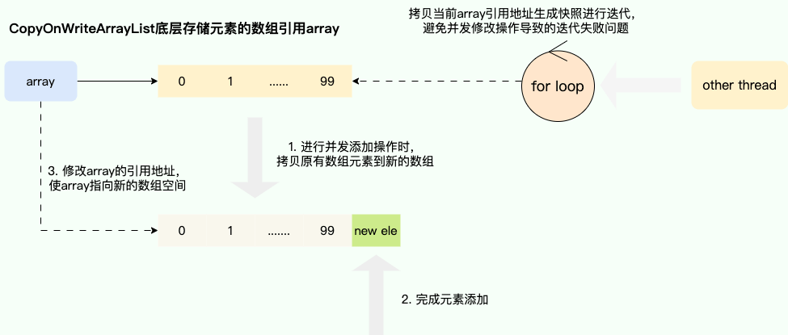

# 1. ArrayList 和 Array（数组）的区别

`ArrayList` 内部基于动态数组实现，比 `Array`（静态数组） 使用起来更灵活：

- `ArrayList`会根据实际存储的元素动态地扩容或缩容；而 `Array` 被创建后长度不可变
- `ArrayList` 可以使用泛型来确保类型安全，`Array` 则不可以
- `ArrayList` 中只能存储对象，对于基本类型数据，需要使用其对应的包装类（如 Integer、Double 等）；`Array` 可以直接存储基本类型数据，也可以存储对象
- `ArrayList` 支持插入、删除、遍历等常见操作（但底层是数组，效率仍然较低），并且提供了丰富的 API 操作方法，如 `add()`、`remove()`等；`Array` 只是一个固定长度的数组，只能按照下标访问其中的元素，不具备动态添加、删除元素的能力
- `ArrayList`创建时不需要指定大小；而`Array`创建时必须指定大小

****
# 2. ArrayList 和 Vector 的区别

- `ArrayList` 是 `List` 的主要实现类，底层使用 `Object[]`存储，适用于频繁的查找工作，但线程不安全 
- `Vector` 是 `List` 的古老实现类，底层使用`Object[]` 存储，线程安全但效率较低，已不推荐使用

****
# 3. Vector 和 Stack 的区别

- `Vector` 和 `Stack` 两者都是线程安全的，都是使用 `synchronized` 关键字进行同步处理
- `Stack` 继承自 `Vector`，在其基础上增加了栈的操作方法（如 `push()`、`pop()`），遵循先进后出（LIFO）的规则

****
# 4. ArrayList 可以添加 null 值吗

`ArrayList` 中可以存储任何类型的对象，包括 `null` 值。但不建议向 `ArrayList`  中添加 `null` 值，因为 `null` 值无意义，并且会让代码难以维护，可能会在某些情况抛出空指针异常。

****
# 5. ArrayList 插入和删除的时间复杂度

对于插入：

- 头部插入：由于需要将所有元素都依次向后移动一个位置，因此时间复杂度是 O(n)。
- 尾部插入：当 `ArrayList` 的容量未达到极限时，往列表末尾插入元素的时间复杂度是 O(1)，因为它只需要在数组末尾添加一个元素即可；当容量已达到极限并且需要扩容时，则需要执行一次 O(n) 的操作将原数组复制到新的更大的数组中，然后再执行 O(1) 的操作添加元素。
- 指定位置插入：需要将目标位置之后的所有元素都向后移动一个位置，然后再把新元素放入指定位置，这个过程需要移动平均 n/2 个元素，因此时间复杂度为 O(n)。

对于删除：

- 头部删除：由于需要将所有元素依次向前移动一个位置，因此时间复杂度是 O(n)。
- 尾部删除：当删除的元素位于列表末尾时，时间复杂度为 O(1)。
- 指定位置删除：需要将目标元素之后的所有元素向前移动一个位置以填补被删除的空白位置，因此需要移动平均 n/2 个元素，时间复杂度为 O(n)。

****
# 6. LinkedList 插入和删除的时间复杂度

- 头部插入/删除：只需要修改头结点的指针即可完成插入/删除操作，因此时间复杂度为 O(1)。
- 尾部插入/删除：只需要修改尾结点的指针即可完成插入/删除操作，因此时间复杂度为 O(1)。
- 指定位置插入/删除：需要先移动到指定位置，再修改指定节点的指针完成插入/删除，不过由于有头尾指针，可以从较近的指针出发，因此需要遍历平均 n/4 个元素，时间复杂度为 O(n)。

****
# 7. LinkedList 为什么不能实现 RandomAccess 接口

`RandomAccess` 是一个标记接口（没有任何方法），用来表明实现该接口的类支持随机访问（即可以通过索引快速访问元素）。由于 `LinkedList` 底层数据结构是链表，内存地址不连续，只能通过指针来定位，不支持随机快速访问，所以不能实现 `RandomAccess` 接口；而 ArrayList 集合的底层结构是数组，所以可以通过下标的方式访问。

****
# 8. ArrayList 和 LinkedList 的区别

- **是否保证线程安全：** `ArrayList` 和 `LinkedList` 都是不同步的，也就是不保证线程安全；
- **底层数据结构：** `ArrayList` 底层使用的是 **`Object` 数组**；`LinkedList` 底层使用的是双向链表。
- **插入和删除是否受元素位置的影响：**
	- `ArrayList` 采用数组存储，所以插入和删除元素的时间复杂度受元素位置的影响。 比如：执行`add(E e)`方法的时候， `ArrayList` 会默认在将指定的元素追加到此列表的末尾，这种情况时间复杂度就是 O(1)。但是如果要在指定位置 i 插入和删除元素的话（`add(int index, E element)`），时间复杂度就为 O(n)。因为在进行上述操作的时候集合中第 i 和第 i 个元素之后的(n-i)个元素都要执行向后位/向前移一位的操作。
	- `LinkedList` 采用链表存储，所以在头尾插入或者删除元素不受元素位置的影响（`add(E e)`、`addFirst(E e)`、`addLast(E e)`、`removeFirst()`、 `removeLast()`），时间复杂度为 O(1)，如果是要在指定位置 `i` 插入和删除元素的话（`add(int index, E element)`，`remove(Object o)`,`remove(int index)`）， 时间复杂度为 O(n) ，因为需要先移动到指定位置再插入和删除。
- **是否支持快速随机访问：** `LinkedList` 不支持高效的随机元素访问，而 `ArrayList`（实现了 `RandomAccess` 接口） 支持。快速随机访问就是通过元素的序号快速获取元素对象(对应于`get(int index)`方法)。
- **内存空间占用：** `ArrayList` 的空间浪费主要体现在在 list 列表的结尾会预留一定的容量空间，而 LinkedList 的空间花费则体现在它的每一个元素都需要消耗比 ArrayList 更多的空间（因为要存放直接后继和直接前驱以及数据）。

****
# 9. ArrayList 扩容机制

[7.2.2 扩容机制](../../../java笔记/Collection集合.md#7.2.2%20扩容机制)

****
# 10. fail-fast 和 fail-safe

- fail-fast：[6.2 fail-fast 机制](../../../java笔记/Collection集合.md#6.2%20fail-fast%20机制)
- fail-safe：翻译为失败安全，它旨在即使面对意外情况也能恢复并继续运行，这使得它特别适用于不确定或者不稳定的环境。

该思想常运用于并发容器，最经典的实现就是 `CopyOnWriteArrayList` 的实现，通过写时复制的思想保证在进行修改操作时复制出一份快照，基于这份快照完成添加或者删除操作后，将 `CopyOnWriteArrayList` 底层的数组引用指向这个新的数组空间，由此避免迭代时被并发修改所干扰所导致并发操作安全问题，当然这种做法也存在缺点，即进行遍历操作时无法获得实时结果：



内部通过创建迭代器，将获取的数组留一个副本给迭代器，

```java
public Iterator<E> iterator() {  
    return new COWIterator<E>(getArray(), 0);  
}
```

所以在修改数组前，会先嗲用迭代器进行一次复制，然后对复制的新数组进行操作，即使中途出现意外也不影响这个新数组

```java
public boolean add(E e) {
    final ReentrantLock lock = this.lock;
    lock.lock();
    try {
        Object[] elements = getArray(); // 读取当前 array
        int len = elements.length;
        Object[] newElements = Arrays.copyOf(elements, len + 1); // 复制array为新数组
        newElements[len] = e;
        setArray(newElements);  // 替换原数组array
        return true;
    } finally {
        lock.unlock();
    }
}
```

****


